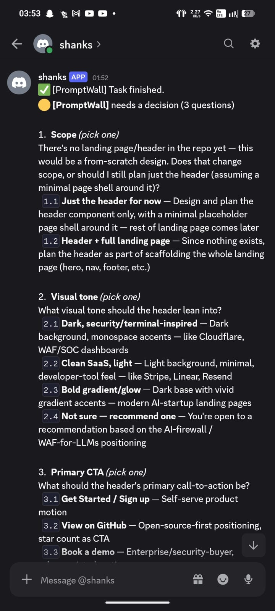
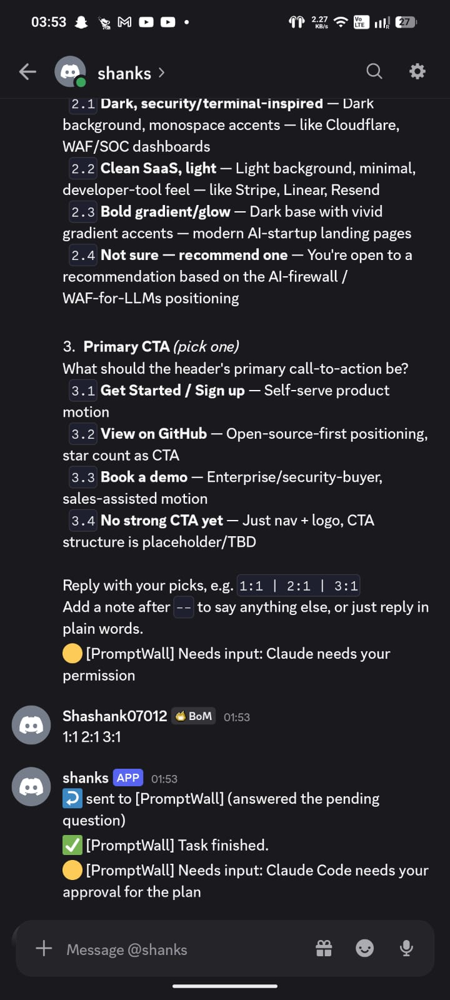
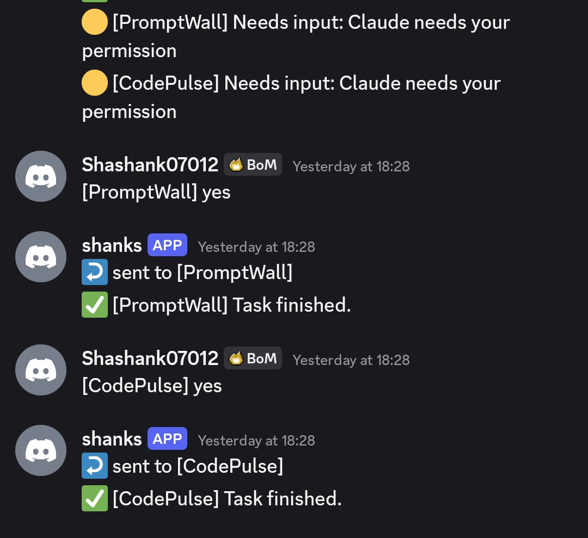

# agent-bridge

[](https://github.com/Shashank0701-byte/agent-bridge/actions/workflows/ci.yml)
[](https://github.com/Shashank0701-byte/agent-bridge/actions/workflows/install.yml)
[](LICENSE)

Get a Discord DM when your coding agent (Claude Code, Codex, etc.) is blocked
waiting on you, reply from your phone, and have that reply typed straight back
into the session -- no need to be at your keyboard.

> It types what you send into a live terminal on your machine, so one Discord
> account is all that stands between a stranger and your shell. Two minutes on
> [Security](#security) before you install is time well spent.

## How it works

The whole thing hinges on one idea: run the agent inside **tmux**, then treat
the terminal itself as the integration point instead of hooking into each
tool's internals differently. That's what makes it work the same way for
Claude Code, Codex, or anything else you run in a terminal.

```
 you AFK                         tmux session "myproject"
   |                                    |
   |  Discord DM  <----- notify.sh <----+  Notification hook fires
   |                                       (Claude Code is waiting on you)
   |
   |  you reply on phone
   v
 bot.py ----> load-buffer + paste-buffer -t myproject, then Enter
                                    |
                                    v
                          agent resumes as if you typed it
```

## What it looks like

Claude hits a decision it cannot make alone. The question, every option, and
its description arrive as a DM -- not a "something needs you" nudge you have to
go and decode.



You answer with the codes it printed. `1:1 2:1 3:1` picks the first option of
each; add a note after `--` and that goes through too. The bridge translates
your picks back into the option labels Claude is waiting for, then confirms what
it did.



Several projects at once each get their own tmux session, and each message is
tagged with the one it came from. Reply to a message, or name the session, and
it lands in the right agent -- never a different one.



## Quick start

**macOS, Linux, or a WSL distro you already have:**

```bash
curl -fsSL https://gitlab.com/shashankchakraborty712005/agent-bridge/-/raw/main/scripts/get.sh | sh
```

That clones the repo to `~/agent-bridge` and runs `bootstrap.sh`. Both are safe
to re-run; the second time it updates in place. If you would rather read it
first -- and piping anything into a shell deserves that -- it is
[scripts/get.sh](scripts/get.sh), and `git clone` then `./scripts/bootstrap.sh`
does exactly the same thing.

The project lives on **GitLab** and is mirrored to **GitHub**; clone whichever
you prefer, they hold the same commits.

```bash
git clone https://gitlab.com/shashankchakraborty712005/agent-bridge.git
git clone https://github.com/Shashank0701-byte/agent-bridge.git
```

`get.sh` clones from GitLab by default because that is where the pipeline runs.
`AGENT_BRIDGE_REPO=https://github.com/Shashank0701-byte/agent-bridge.git` points it at the mirror instead.

**Windows** has two options, because half the bridge works natively and half
does not -- see [Windows without WSL](#windows-without-wsl) for why.

```powershell
git clone https://gitlab.com/shashankchakraborty712005/agent-bridge.git      # or the GitHub mirror, above
cd agent-bridge

.\scripts\install_windows.ps1     # notifications only, no WSL at all
.\install.ps1                     # the whole thing: installs WSL2 + Ubuntu
```

The script then offers to walk you through creating the Discord bot. It checks
each value as you type it and sends a real test DM, so it either finishes with a
working bridge or tells you exactly which portal step was missed. The one thing
left for you is `claude auth login`.

To run that part on its own, or to work out why a working setup stopped:

```bash
scripts/setup_discord.py            # guided setup, verifies as it goes
scripts/setup_discord.py --check    # test the credentials already in .env
```

## Requirements

Read these before installing -- two of them are hard gates:

- **A paid Claude plan.** Claude Code needs Pro, Max, Team, Enterprise, or a
  Console account. The free claude.ai tier does **not** include it, and there is
  no way around this.
- **Your own Discord bot.** The bridge is single-user by design: it answers one
  allowlisted user ID. Bots aren't shareable between people -- everyone who
  wants this creates their own (about five minutes, steps below).
- **tmux**, the load-bearing dependency, which has no Windows build. On Windows
  everything runs inside WSL2 -- agent, tmux, and bot on the same machine. If
  WSL isn't installed yet, `wsl --install` needs one Administrator PowerShell
  and a reboot; `install.ps1` tells you so and stops rather than half-finishing.
- **Python 3.8+** (`python3` or `python`, either is detected).

Tested on Ubuntu 22.04 and 24.04 under WSL2, from a cold install. The macOS and
native-Linux paths in `bootstrap.sh` are written but have not been run -- expect
rough edges there and tell me about them.

## Folder structure

```
agent-bridge/
├── README.md
├── .env.example                      # copy to .env and fill in
├── requirements.txt
├── config/
│   └── claude-settings.snippet.json  # merged into ~/.claude/settings.json
├── hooks/                            # OUTBOUND, and portable: these run on Windows too
│   ├── notify.py                     # hook -> Discord DM
│   ├── ask_options.py                # multiple-choice questions -> Discord
│   ├── notify.sh, ask_options.sh     #   thin shims, for settings.json written by older installs
│   ├── lib/bridge.py                 #   .env, session name, state file, pane options
│   └── lib/discord_send.py           #   shared DM sender (chunks past 2000 chars)
├── bot/
│   └── bot.py                        # INBOUND: Discord DM -> tmux
├── poller/
│   └── watch_pane.sh                 # fallback for agents with no hook system
├── tests/                            # pytest: pure logic + a real tmux session
├── ci/
│   ├── guard.sh                      # secrets, line endings, exec bits
│   ├── bootstrap_smoke.sh            # runs bootstrap.sh in a clean container
│   ├── install_smoke.sh              # runs the one-liner in a bare container
│   └── analyze_powershell.ps1        # parse check for the Windows installer
└── scripts/
    ├── lib/session_name.sh           # shared: folder -> tmux session name
    ├── start_session.sh              # launch a session for a project directory
    ├── claude-wrapper.sh             # template for the transparent `claude` shim
    ├── install_wrapper.sh            # installs that shim (fully automatic mode)
    ├── bot_ctl.sh                    # start/stop/status/logs for the bot
    ├── get.sh                        # the one-command install
    ├── setup_discord.py              # guided Discord setup (--check to re-test)
    ├── install.sh                    # one-time setup: wires the hooks
    ├── install_windows.ps1           # Windows without WSL: notifications only
    ├── install_autostart.ps1         # Windows: run the bot at logon
    └── final_test.sh                 # post-login end-to-end check
```

## Creating the Discord bot

1. Go to the [Developer Portal](https://discord.com/developers/applications) ->
   **Create App**, give it a name.
2. **Bot** tab -> **Reset Token** -> copy it. That's `DISCORD_BOT_TOKEN`.
   Leave all three Privileged Gateway Intents **off** -- you don't need them
   (see below). Treat this token like a password: it is full control of the bot.
3. **Installation** tab -> under *Guild Install*, set scope `bot` and tick the
   **Send Messages** permission. Copy the **Install Link** at the top.
4. A bot can only DM you if you share a server with it, so make a throwaway
   private server (**+** in the sidebar -> Create My Own), then open the install
   link, choose **Add to server**, and pick it. You never have to use that
   server again -- it exists purely to establish the shared membership.
5. In that server: **right-click it -> Privacy Settings -> Direct Messages** on.
   If this is off, the bot's DM is rejected with a 403 even though everything
   else is configured correctly. This is the single most common setup trap.
6. Get your own user ID: **User Settings -> Advanced -> Developer Mode** on,
   then right-click your own name -> **Copy User ID**. That's `DISCORD_USER_ID`.

> **Why no Message Content intent?** It's a privileged intent normally needed
> to read message text, but Discord documents an explicit exception for
> "content in DMs with the app." Since this bot only ever listens in your DMs,
> it gets full message content without it -- one less approval to chase.

### Which notifications reach your phone

Claude Code's `Notification` event covers several notification *types*, and the
hook config matches only the ones that actually mean "blocked on you":

| Type | DM? | Why |
|------|-----|-----|
| `permission_prompt`      | yes | Claude is asking to run something |
| `agent_needs_input`      | yes | a subagent needs an answer |
| `elicitation_dialog`     | yes | Claude is asking you a question |
| `elicitation_url_dialog` | yes | Claude wants you to open a URL |
| `idle_prompt`            | no  | you just left the session sitting at the prompt |
| `auth_success`           | no  | not a question |
| `agent_completed`        | no  | the `Stop` hook already covers this |

Without a matcher the event fires for *every* type, and `idle_prompt` in
particular pings you each time a session goes quiet -- which is constantly.
Widen or narrow the `matcher` in
`config/claude-settings.snippet.json` to taste, then re-run `./scripts/install.sh`.

## Setup

```bash
scripts/setup_discord.py  # guided: asks for the two values and verifies both

# Ubuntu 24.04+ and Debian 12+ enforce PEP 668, so a system-wide `pip install`
# is refused with "externally-managed-environment". Use a venv.
python3 -m venv ~/.venvs/agent-bridge
~/.venvs/agent-bridge/bin/pip install -r requirements.txt

./scripts/install.sh      # wires the Notification/Stop hooks into ~/.claude/settings.json
```

Only `bot.py` needs those packages. `notify.sh` is pure standard library, so the
hook keeps working regardless of which interpreter fires it.

`install.sh` backs up your existing `settings.json` first, substitutes this
repo's real path into the hook commands, and appends its hooks alongside any
you already had rather than replacing them. Re-running it is safe -- it
replaces its own previous entries instead of stacking up duplicates.

Then start the bot, and have it come back on its own after a reboot:

```bash
./scripts/bot_ctl.sh start        # start now (supervised: restarts if it crashes)
./scripts/bot_ctl.sh status       # running? last few log lines?
./scripts/bot_ctl.sh logs         # tail the log
./scripts/bot_ctl.sh stop
```

**Exactly one supervisor runs, whatever starts it.** That matters because two
things here both call `start`: the `claude` wrapper does it on every invocation,
and the Windows logon task does it at boot. A liveness check alone is not enough
-- both can pass it in the same instant and each spawn a supervisor. Two bots on
one token then receive every DM and both type your reply into tmux: a doubled
message, or on a prompt a digit that chooses and a second digit that lands
wherever the UI went next.

The supervisor takes an atomic lock (`mkdir`, not `flock`, which macOS does not
ship) and holds it for its lifetime; a second one exits immediately. A lock left
behind by a `kill -9` or a reboot is reclaimed only once its owner is confirmed
dead, so a stale lock can never wedge the bridge and a live one can never be
stolen.

On Windows/WSL, register the logon task so it survives a reboot. Run this from
PowerShell, in the repo directory (no admin needed):

```powershell
.\scripts\install_autostart.ps1              # remove later with -Uninstall
```

> **Why a Windows task rather than a systemd service?** A service inside WSL only
> runs while the distro is up. After a Windows reboot the distro isn't running at
> all until something starts it, so the trigger has to live on the Windows side.
> The task starts the distro *and* the bot. On a native Linux box, a systemd user
> unit running `bot_ctl.sh supervise` is the equivalent.

## Using it on your other projects

**There is no per-project setup.** The hooks live in `~/.claude/settings.json`,
which is user-level, so they already fire for every project on the machine. The
bot is shared and routes purely by tmux session name -- it neither knows nor
cares which directory anything is in.

### Fully automatic: the `claude` wrapper

```bash
./scripts/install_wrapper.sh      # once; --uninstall to remove
```

After this, just type `claude` in any project and the bridge turns itself on:

```bash
cd ~/code/portfolio && claude     # that's it
```

The wrapper starts the bot if it isn't running, puts the session in tmux named
after the folder, then runs the real claude. Re-running in the same folder
reattaches rather than making a second session.

**It also picks up where that folder left off.** The wrapper passes
`--continue`, so `claude` in a project rejoins that project's last conversation
instead of starting an empty one. This is the difference that matters after a
reboot: tmux's `-A` only rejoins a session that still *exists*, and the whole
point of the bridge is walking away from a session and coming back hours later.
`--continue` is scoped to the current directory, so it can never pull in another
project's conversation, and in a folder with no history it just starts fresh.

```bash
AGENT_BRIDGE_RESUME=0 claude      # deliberately start a new conversation
```

If you pass a conversation flag yourself -- `-c`, `-r/--resume`, `--from-pr`,
`--cloud`, `--bg` -- the wrapper adds nothing, on the grounds that you have
already said what you want.

It stays out of the way when wrapping would be wrong -- `claude -p ...`, piped
or non-TTY invocations all `exec` straight through to the real binary.
`AGENT_BRIDGE_WRAP=0 claude` skips it entirely for one run.

The wrapper installs to `~/.agent-bridge/bin/claude`, deliberately *not* over
`~/.local/bin/claude`, so Claude Code's auto-updater keeps managing its own
launcher. The PATH line goes in **both** `~/.bashrc` and `~/.profile`: Ubuntu's
`.profile` sources `.bashrc` first and only then prepends `~/.local/bin`, so a
line in `.bashrc` alone ends up behind the real binary in login shells and the
wrapper silently never runs.

### Manual: launch a session yourself

If you'd rather not shadow the `claude` command:

```bash
cd ~/code/portfolio && /path/to/agent-bridge/scripts/start_session.sh
```

That opens a tmux session named after the folder (`portfolio`), running `claude`
in it. Notifications arrive labelled `🟡 [portfolio] ...`, and a plain Discord
reply goes there because the state file tracks whichever session pinged last.

```bash
./scripts/start_session.sh                      # session named after $PWD
./scripts/start_session.sh ~/code/api           # from anywhere
./scripts/start_session.sh ~/code/api codex     # run codex instead of claude
SESSION_NAME=api-v2 ./scripts/start_session.sh ~/code/api   # override the name
```

Run several at once and target them explicitly from Discord with
`!portfolio your reply` / `!api your reply`; `!sessions` lists what's live.

Worth putting on your PATH so it's available from any directory:

```bash
ln -s /path/to/agent-bridge/scripts/start_session.sh ~/.local/bin/agent-session
```

## Complete flow

1. `start_session.sh myproject` opens tmux session `myproject` and launches
   the agent inside it.
2. You work as normal. The agent hits something it needs your input on ->
   Claude Code's `Notification` hook fires -> `notify.sh` reads the hook's
   JSON off stdin, extracts the question, records `myproject` as the
   "last active session" in a small state file, and DMs you.
3. You're away -> phone buzzes: `🟡 [myproject] Needs input: ...`.
4. You reply in the DM. Three ways to say which session you mean, tried in
   this order:

   | How | When to use it |
   |-----|----------------|
   | **Use Discord's reply button** on the notification | easiest, and the point of the design -- the session is read off the message you replied to |
   | `[myproject] your reply` (or `!myproject your reply`) | naming it explicitly; matching is case-insensitive |
   | plain text, no prefix | goes to whichever session pinged last |

   `!sessions` (or `[sessions]`) lists what's live. When a prompt is on screen,
   `pick 2` chooses option 2 -- see below. If the agent has exited and the pane
   is back at a shell, replies are refused; `!run <command>` sends anyway, so
   you can restart it from your phone.

### Multiple-choice questions

When Claude needs a decision it calls its `AskUserQuestion` tool, and a
`PreToolUse` hook hands the bridge the whole thing -- every question, option
label, description, and whether it's multi-select. So the choices arrive on your
phone rather than only on screen:

```
🟡 [PromptWall] needs a decision (3 questions)

1. Visual tone (pick one)
   2.1 Dark, security/terminal-inspired — monospace accents, WAF/SOC feel
   2.2 Clean SaaS, light — minimal, developer-tool feel
   ...

Reply with your picks, e.g. 1:1 | 2:1 | 3:1
Add a note after -- to say anything else.
```

Reply `1:1,2 | 2:1 -- keep the logo left-aligned` and the bridge turns the
numbers back into the option labels Claude expects, appending your note.
Separators are lenient: `1:1 2:1 3:1`, `1.1`, and stray spaces all parse. A
reply with no picks in it is passed through as ordinary free text.

### Selectors are never silently confirmed

Claude Code shows modal selectors for plan approval, folder trust, and question
cards. A prose reply sent while one is open used to select the highlighted
option -- on a plan approval that silently approved the agent and it started
editing files.

Measured against Claude Code 2.1.241, using the folder-trust prompt because its
option 2 is "No, exit" and so reports its own outcome:

| Input | What the widget does |
|-------|----------------------|
| `send-keys 2` | selects option 2 immediately -- no Enter needed |
| `paste "2"` | also selects option 2 |
| `paste "hello"` | **selects the highlighted option, with no Enter at all** |
| `send-keys Down` | moves the marker, leaves the prompt open |
| `send-keys Space` | ignored |
| `send-keys Escape` | dismisses it (on the trust prompt, that exits Claude) |

The third row is the dangerous one, and it is broader than "don't press Enter":
**pasting ordinary prose is enough to approve a plan.** So the bridge sends
`Esc` and then *verifies the widget is gone* before it types anything. If it is
still there, nothing is sent and Discord tells you so -- refusing is always
recoverable, typing into a live widget is not.

Answering one is the first row: `pick 2` presses the digit `2`, which selects
that option outright. No arrow keys, no Enter, no cursor position to get wrong.
A bare `2` works too, once the options have been listed in the DM.

```
🟡 [portfolio] Needs input: Claude needs your permission to run ls
❯ 1. Yes
  2. Yes, and don't ask again
  3. No, tell Claude what to do differently
Reply `pick <n>` to choose, or send text to dismiss it.
```

Options outside 1-9 are refused rather than guessed at: the first digit of "12"
would already have chosen something. A `pick` aimed at an `AskUserQuestion` card
is refused too and points you at the `1:2` syntax, because a digit into a
multi-select card has not been tested -- and guessing keystrokes is what caused
the original bug.

Detection keys off the selector footer (`Enter to select` / `Esc to cancel`),
which is deliberately distinct from the busy footer (`esc to interrupt`) so a
reply sent mid-task is not mistaken for one.

Two implementation notes, both learned the hard way:

- **The hook does not block.** `PreToolUse` runs *before* the tool, so blocking
  would stop the question card rendering and lock you out of answering at your
  own keyboard. It notifies and exits immediately.
- **Answers are sent as one line, after `Esc`.** Esc dismisses the card and
  returns the pane to the normal prompt, which is immune to the card's layout
  changing between versions. A newline pasted into Claude Code's input box
  arrives as a carriage return and corrupts the text, so composed answers are
  joined with `; ` instead.

   If you name a session that isn't running, the bridge says so and sends
   **nothing**. It deliberately does not fall back to the last-pinged session,
   because typing your answer into a different live agent is worse than making
   you retype it.
5. `bot.py` receives it, verifies the sender is you, resolves the target
   session, and types the text into that pane followed by Enter.
6. The agent sees the input exactly as if you'd typed it and continues.
7. When the whole task finishes, the `Stop` hook fires ->
   `✅ [myproject] Task finished.`

For agents without a native hook system (Codex, as far as could be confirmed
at the time this was written -- worth checking their current docs), use
`poller/watch_pane.sh <session-name>` instead of relying on hooks:

```bash
./poller/watch_pane.sh mysession
IDLE_SECS=5 PROMPT_REGEX='\(y/n\)|continue\?' ./poller/watch_pane.sh mysession
```

It polls the pane, and once the visible output has been unchanged for
`IDLE_SECS` and a recent line matches `PROMPT_REGEX`, it fires the same
`notify.sh` with the line that matched. It stops on its own when the session
goes away.

This is a heuristic, not a hook: expect to tune `PROMPT_REGEX` per tool. Two
things it gets right that are easy to get wrong -- `tmux capture-pane` returns
the full pane height and output sits at the *top*, so blank lines are stripped
before looking at the tail (otherwise nothing ever matches); and the line
reported is the one that matched, not simply the last line, since a prompt is
often followed by an input row.

## Verifying it works

You don't need a real agent run to test either leg:

```bash
echo '{"message":"test ping"}' | ./hooks/notify.sh input   # -> a DM should arrive
```

Then, in the DM, send `!sessions` -- it should list your live tmux sessions.
To check the reply path end to end:

```bash
tmux new -d -s scratch
# reply in the DM, then:
tmux capture-pane -t scratch -p | tail -3                  # your text should be in the pane
```

## Continuous integration

`.gitlab-ci.yml` runs on every push, and `.github/workflows/` runs the same
checks on the mirror. No job depends on another, so they all start at once and
the pipeline takes as long as its slowest job rather than the sum of them.

| Job | What it protects |
|---|---|
| `guard` | `.env` never committed, no token anywhere in history, no CRLF in a `.sh`, every script committed executable |
| `lint:shell` | shellcheck over all 13 shell scripts |
| `lint:python` | ruff |
| `lint:powershell` | the `.ps1` files at least parse -- the only automated check the Windows path gets |
| `test:unit` | reply parsing, pick-to-label translation, 2000-char chunking, and the `install.sh` hook merge against a settings file that already has hooks |
| `test:tmux` | a real tmux session: replies starting with `-`, ending with `;`, or reading `Enter` must arrive byte for byte |
| `smoke:bootstrap` | `bootstrap.sh` end to end on clean Ubuntu 22.04 and 24.04, twice, checking a login shell really resolves `claude` to the wrapper |
| `smoke:install` | the one-liner above, from a bare container: install git, clone the commit under test from the real remote, run it twice, and refuse to clobber a directory it did not create |

`smoke:bootstrap` is the slow one, so it is gated: it runs on `main`, on merge
requests that touch the install path, manually anywhere else, and on a weekly
schedule that downloads the real Claude Code installer -- so upstream changing
that installer shows up here instead of on a new user's first afternoon.

Run any of it locally:

```bash
pip install -r requirements.txt pytest
pytest                       # the tmux tests skip themselves if tmux is missing
bash ci/guard.sh
```

**What CI does not cover.** `install.ps1` needs a Windows runner, and the
modal-selector handling needs a live Claude Code UI. Both are still checked by
hand, so a green pipeline is not a claim that the Windows installer works.

## Windows without WSL

`claude.exe` runs natively on Windows, and so does half of this project.

```powershell
.\scripts\install_windows.ps1     # -Uninstall to remove
```

That wires the outbound hooks into native Claude Code. Permission prompts,
question cards and task-finished all reach your phone from a `claude` session
started in PowerShell, with no WSL anywhere. **Replying from Discord still needs
the WSL setup.**

**Why the split.** The inbound leg types your reply into a *live* interactive
session, which means owning the terminal input of a running process. That is
what tmux does, and Windows has no equivalent. The alternatives are worse than
they look:

- *SendKeys / UI Automation* needs the window focused, breaks the moment you
  touch the mouse, and can type into the wrong window. For something that types
  into an agent with file-write powers, that is the failure this project has
  worked hardest to make impossible.
- *A ConPTY host* -- spawning `claude` inside a pseudo-console the bridge owns
  -- does work, but a session has to survive closing the window, so it needs a
  persistent background host with attach/detach, resize handling and crash
  recovery. That is writing a small tmux, in the most dangerous part of the
  system.

So the honest answer is half the product without WSL, clearly labelled, rather
than a reply path that types into whatever window happens to be in front.

**One trap worth knowing** if you ever wire this up by hand: `bash` on a normal
Windows PATH is `C:\WINDOWS\system32ash.exe`, the WSL shim. A hook pointed at
a `.sh` file would run *inside WSL*, in a different operating system from the
agent that fired it and with a different view of the filesystem. It would not
fail cleanly -- it would half-work. That is why the hooks are Python and why
`install_windows.ps1` writes commands that call `python` directly.

## Security

This types text you send from Discord into a live terminal on your machine, so
it is worth being exact about what that does and does not mean.

**Only one account can drive it.** Every DM's author ID is compared against
`DISCORD_USER_ID` and anything else is dropped and logged. There is no group
mode, no second user, no override. An unstarted bot has `ALLOWED_USER_ID = 0`,
which matches no Discord user -- it fails closed rather than open.

**Your Discord account is the key.** Anyone who can send DMs as you can type
into your agent, and an agent can be asked to run commands -- it will, without
asking, if you have auto-approve on. Treat that as equivalent to shell access on
the machine. If you would not leave that terminal unlocked in a cafe, put 2FA on
the Discord account.

**The bot token is not the key.** Someone who steals it can read the DM history
with the bot and post messages *as* the bot, but cannot make the bridge type
anything: injection needs a message whose author ID is yours, and the token does
not grant that. Rotate it anyway if it leaks -- that history contains your
notifications and your replies.

**If the agent has exited, the pane is a shell** -- and anything typed into it
runs as a command. The bridge checks what a pane is actually running before
typing and refuses when that is a shell, so a reply meant for a prompt is not
handed to `bash` instead. `"yes"` would have been harmless; `"remove the temp
files"` would not.

That check is a denylist of shells rather than an allowlist of agents, on
purpose. tmux reports the pane's *foreground* command, so a pane busy running
`npm` reports `npm` -- an allowlist would refuse perfectly good replies -- and
the bridge is meant to work with any CLI agent, which cannot be enumerated.
Shells can. `!run <command>` sends anyway, which is how you restart an agent
that died while you were out.

**What crosses the network.** Your code is not uploaded anywhere. What does
leave the machine is the text of the notification and the question card -- which
routinely quotes your code, file names and design decisions -- travelling to
Discord's servers and sitting in a DM history. If that is not acceptable for the
work you do, this is not the tool for you, and no amount of configuration
changes that.

**What the bridge refuses to do**, all of it learned from something going wrong:

- A reply naming a session that is not live is **refused**, never redirected to
  another one. Typing into the wrong agent is worse than making you retype.
- Nothing is pasted into a pane while a modal prompt is still up -- pasting is
  enough to select the highlighted option, which once approved a plan by itself.
  If the prompt will not close, the reply is not sent and you are told.
- `pick` outside 1-9 is refused rather than guessed at, because the first digit
  of "12" would already have chosen something.
- Exactly one bot process runs at a time, so a reply cannot be typed twice.

**Where the token lives.** `.env`, which is gitignored. `ci/guard.sh` fails the
build if `.env` is ever committed, or if a token-shaped string appears anywhere
in the repository's history -- including in a commit that later deleted it.

## Design decisions

- **tmux as the universal interface.** Every coding-agent CLI is just a
  terminal program underneath. Instead of learning each tool's internal API,
  the bridge types into the terminal -- works identically no matter which
  agent you're running.
- **Native hooks where available, polling where not.** Claude Code's
  `Notification` event fires exactly when it's blocked on you -- reliable, no
  guesswork. Tools without that get the pane-watching fallback instead.
- **DMs rather than a channel.** Keeps the privileged Message Content intent
  out of the picture entirely, and means plain-text replies work without
  having to @mention the bot every time.
- **Paste buffers, not `send-keys <text>`.** `send-keys` runs your text
  through tmux's own argument parser, which mangles real replies three
  different ways: one starting with `-` is rejected as an invalid flag
  ([tmux#4408](https://github.com/tmux/tmux/issues/4408)), one that happens to
  read `Enter` or `Up` is sent as that keypress instead of the word, and a
  trailing `;` is read as a command separator
  ([tmux#1849](https://github.com/tmux/tmux/issues/1849)). Loading the text
  into a paste buffer from stdin bypasses that parser completely.
- **`!` prefix, not `/`.** A leading slash triggers Discord's native
  slash-command autocomplete, which pops up an unhelpful "no commands match"
  every time you start a reply.
- **One long-running bot, not one per session.** Sessions are tracked by tmux
  session name; a state file remembers whichever session pinged last, so a
  plain reply auto-targets it. `!session-name text` overrides that when
  multiple sessions are live.
- **User ID allowlist, no exceptions.** Typing into a terminal is effectively
  remote shell access to your machine, so the bot drops any message that isn't
  a DM from your own user ID.
- **Runs on the same host as tmux.** tmux is driven locally, not over the
  network, so the bridge has to run wherever your sessions actually live. If
  your laptop sleeps when you walk away, put this on a small always-on VPS and
  SSH/tmux into your real work from there instead.

## Known limitations

- The poller fallback can misfire on tools whose prompts don't match
  `PROMPT_REGEX` -- expect to tune it per-tool.
- No message queue -- if the bot process is down when a notification fires,
  that ping is lost (though the session itself just stays paused, nothing is
  lost on the agent side).
- Notifications are truncated to Discord's 2000-character message limit.
- Single-user only by design (one allowlisted user ID). Extending to a team
  would need per-user session ownership, which this doesn't attempt.
- The bridge reads which command a pane is running to decide whether it is safe
  to type into, and tmux reports the *foreground* command. A pane whose agent
  has spawned an interactive shell of its own therefore reads as a shell, and
  replies to it need `!run`.

## License

MIT -- see [LICENSE](LICENSE). Use it, fork it, ship it.
